# Hallucination Detection for Vietnamese Medical RAG Systems
# Do cái hệ thống làm CV nó ko hiện hết link repo nên đã cắn mất "G Systems" nên đành phải rename lại để link trong CV hoạt động được. 

Hệ thống hỏi đáp y tế tiếng Việt dựa trên Retrieval-Augmented Generation (RAG), kết hợp một tầng kiểm chứng hậu sinh (post-generation verification) bằng PhoBERT để phát hiện câu trả lời có được ngữ cảnh hỗ trợ hay không.

Mục tiêu của project là xây dựng một pipeline có thể:

- truy xuất tài liệu y tế liên quan từ knowledge base;
- đưa ngữ cảnh truy xuất được vào mô hình sinh câu trả lời;
- kiểm tra câu trả lời bằng bộ phân loại hallucination;
- đánh giá định lượng bằng retrieval metrics, generation metrics và hallucination detection metrics.

Dataset gốc thuộc miền biomedical QA tiếng Anh, sau đó được dịch và chuẩn hóa sang tiếng Việt theo định dạng JSONL dùng trong project.

## Tóm Tắt

Trong các hệ thống hỏi đáp y tế, lỗi hallucination đặc biệt nghiêm trọng vì mô hình ngôn ngữ có thể sinh ra thông tin nghe hợp lý nhưng không được tài liệu hỗ trợ. Project này tách hệ thống thành hai module chính:

1. **RAG pipeline/module**: gồm retriever và LLM generator. Retriever tìm tài liệu liên quan; LLM generator dùng tài liệu đó để sinh câu trả lời.
2. **Hallucination Detection module**: dùng PhoBERT fine-tuned để kiểm tra câu trả lời sau khi sinh.

PhoBERT trong project này **không sinh câu trả lời**. PhoBERT đóng vai trò verifier, nhận vào:

```text
Question + Answer + Retrieved Context
```

và dự đoán:

```text
supported | hallucinated
```

## Kết Quả Chính

Sau khi sửa lỗi formatter làm mất phần answer do truncation và train lại PhoBERT:

| Metric | Giá trị |
|---|---:|
| Accuracy | 0.8078 |
| Macro F1 | 0.8032 |
| Supported Precision | 0.7355 |
| Supported Recall | 0.9614 |
| Supported F1 | 0.8334 |
| Hallucinated Precision | 0.9443 |
| Hallucinated Recall | 0.6542 |
| Hallucinated F1 | 0.7730 |

Confusion matrix trên toàn bộ benchmark:

| Gold \ Predicted | supported | hallucinated |
|---|---:|---:|
| supported | 3167 | 127 |
| hallucinated | 1139 | 2155 |

Kết quả này cải thiện mạnh so với checkpoint cũ, vốn gần như dự đoán toàn bộ sample là `supported` và có hallucinated recall bằng 0.

## Hình Ảnh Kết Quả

Các hình dưới đây được sinh từ script report trong project.

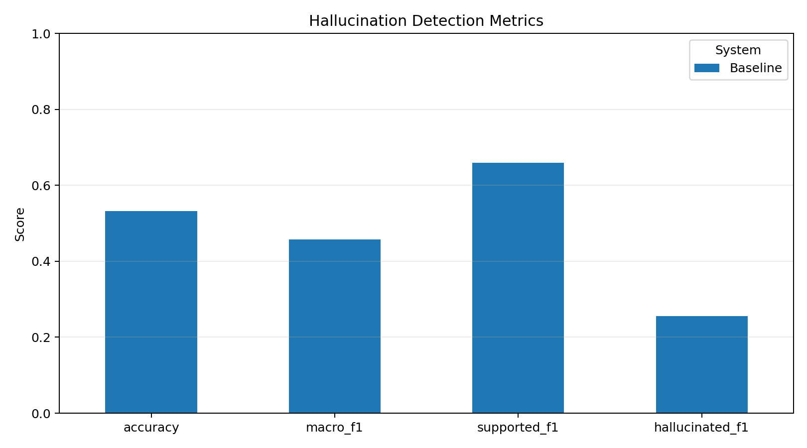

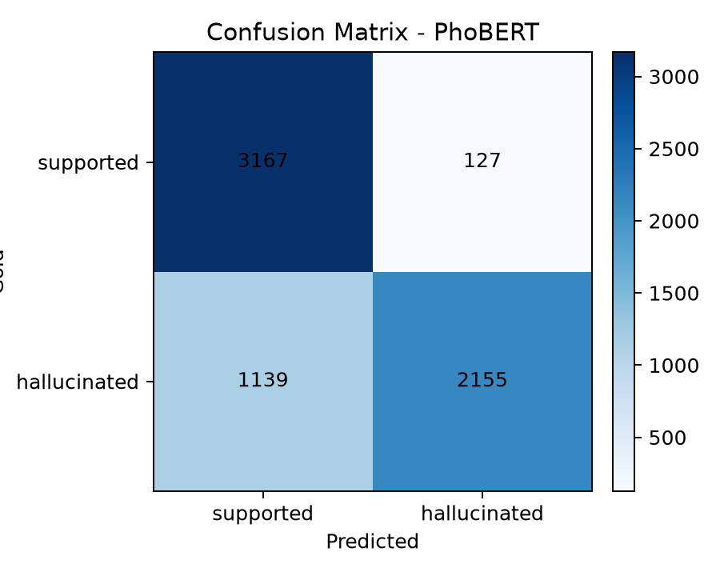

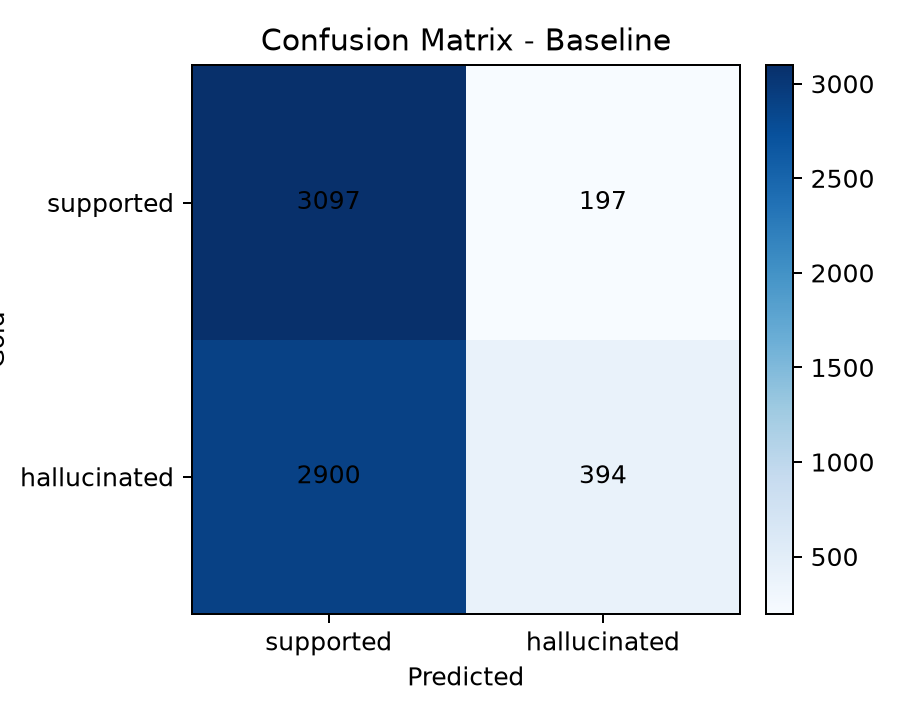

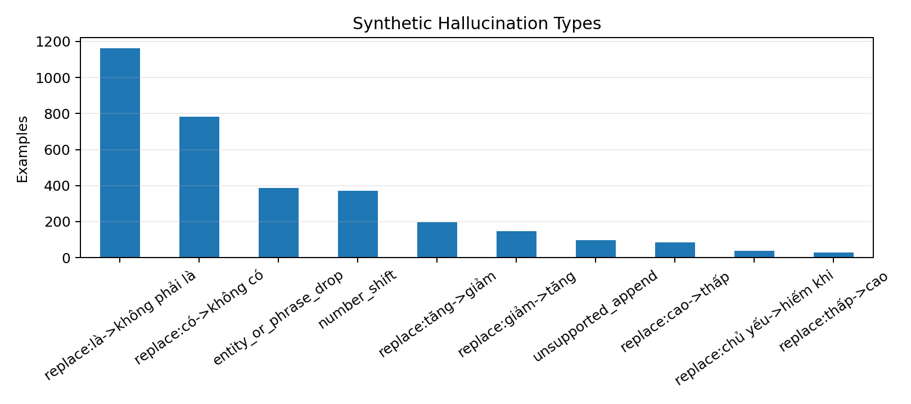

## Bài Toán

Một hệ thống RAG y tế thường hoạt động theo chuỗi:

```text
Question -> Retrieval -> Context -> LLM -> Answer
```

Tuy nhiên, việc có thêm context không bảo đảm câu trả lời luôn đúng. LLM vẫn có thể:

- thêm thông tin không có trong tài liệu;
- hiểu sai quan hệ nguyên nhân - kết quả;
- thay đổi số liệu, liều lượng, thời gian;
- phủ định sai một kết luận y khoa;
- trộn thông tin từ nhiều tài liệu khác nhau.

Vì vậy project bổ sung tầng kiểm chứng:

```text
Question + Answer + Context -> PhoBERT verifier -> supported/hallucinated
```

## RAG Là Gì?

RAG, viết tắt của Retrieval-Augmented Generation, là phương pháp kết hợp truy xuất tài liệu với mô hình sinh ngôn ngữ. Thay vì yêu cầu LLM trả lời hoàn toàn từ kiến thức tham số đã học, hệ thống trước tiên tìm các tài liệu liên quan trong knowledge base, sau đó đưa các tài liệu này vào prompt để LLM sinh câu trả lời có căn cứ hơn.

### Trực Giác

Nếu không có RAG:

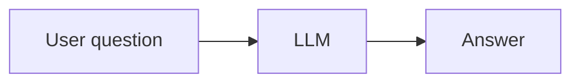

Mô hình có thể trả lời dựa trên kiến thức nội tại, nhưng không có bằng chứng rõ ràng đi kèm.

Nếu có RAG:

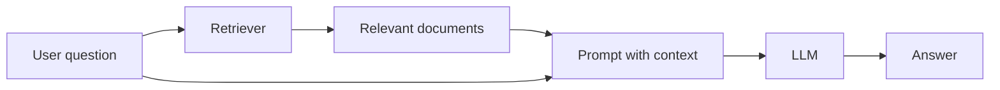

LLM được cung cấp thêm context, nên câu trả lời có khả năng bám sát tài liệu hơn.

### RAG Trong Project Này

Trong code hiện tại có hai phần retrieval:

- `src/rag/query_rag.py`: pipeline RAG chạy trực tiếp bằng dense retrieval từ Chroma vector store.
- `src/rag/hybrid_retriever.py`: module hybrid BM25 + dense dùng để kiểm thử/truy xuất độc lập; có thể tích hợp vào `query_rag.py` trong bước cải tiến tiếp theo.

Vì vậy, khi nói **RAG pipeline/module**, cần hiểu là toàn bộ chuỗi `retriever + prompt + LLM generator`. Retriever có thể là dense retriever hiện đang chạy trong `query_rag.py`, hoặc hybrid retriever nếu được tích hợp.

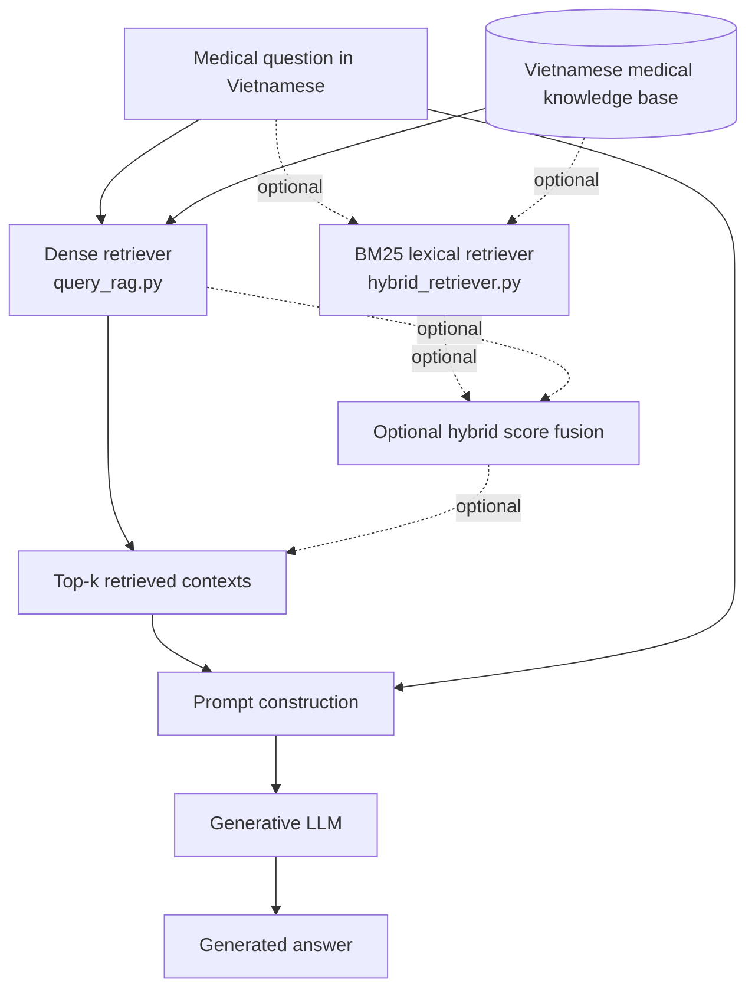

RAG là phần **retriever + generator**. PhoBERT verifier là module riêng nằm sau RAG.

## Kiến Trúc Tổng Thể

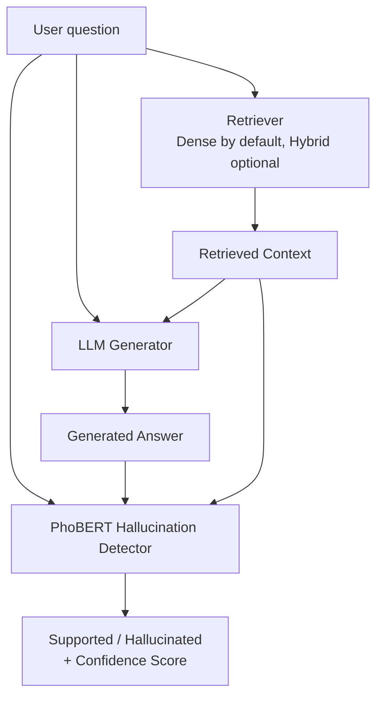

Module verifier giúp trả lời câu hỏi: **câu trả lời này có được ngữ cảnh truy xuất hỗ trợ hay không?**

## Pipeline Thực Nghiệm

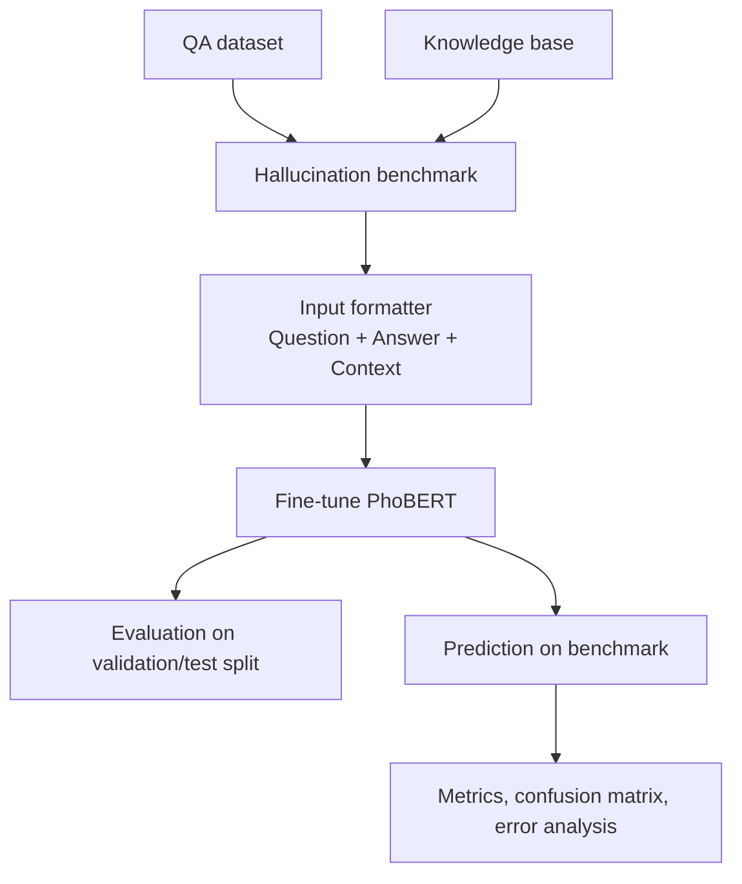

## Vì Sao Formatter Quan Trọng?

Transformer encoder có giới hạn độ dài đầu vào. Với PhoBERT, script tự điều chỉnh `max_length` theo khả năng của model; trong log thực nghiệm, giá trị sử dụng là:

```text
Using max_length=256
```

Format cũ:

```text
Question
Context
Answer
```

Context thường rất dài, nên answer ở cuối sequence có thể bị truncate. Khi answer bị mất, model chỉ nhìn thấy question và phần đầu context; hai sample `supported` và `hallucinated` có thể trở nên gần như giống nhau.

Format mới:

```text
Question
Answer
Context
```

Phần answer được đặt trước context, giúp model luôn thấy thông tin cần kiểm chứng trước khi context bị cắt ở phần cuối.

Kết quả diagnostic sau khi sửa:

```text
samples: 6588
labels: {'supported': 3294, 'hallucinated': 3294}
context words avg/p95/max: 421.0/763/820
answer words avg/p95/max: 54.3/155/257
original tokens avg/p95/max: 677.7/1189/1516
after truncation avg/max: 243.4/256
cut tokens avg/p95/max: 434.2/933/1260
answer prefix preserved: 6328/6588 (96.1%)
```

## PhoBERT Hallucination Detector

PhoBERT được fine-tune như một binary classifier.

### Input

```text
Câu hỏi:
<question>

Câu trả lời cần kiểm chứng:
<answer>

Ngữ cảnh:
<retrieved context>
```

### Output

| Label | Ý nghĩa |
|---|---|
| `supported` | Câu trả lời được ngữ cảnh hỗ trợ |
| `hallucinated` | Câu trả lời chứa thông tin không được ngữ cảnh hỗ trợ hoặc mâu thuẫn với ngữ cảnh |

### Label Mapping

| Label | ID |
|---|---:|
| supported | 0 |
| hallucinated | 1 |

## Hallucination Benchmark

Benchmark được tạo từ QA dataset và knowledge base. Với mỗi câu hỏi, project tạo:

- một sample `supported`: dùng answer gốc;
- một sample `hallucinated`: tạo answer bị nhiễu có kiểm soát.

Các dạng hallucination được hỗ trợ:

- phủ định sai kết luận;
- thay đổi số liệu;
- thay đổi liều lượng;
- thay thế thực thể y khoa;
- mâu thuẫn thời gian;
- bỏ cụm thông tin quan trọng;
- thêm claim không có trong tài liệu.

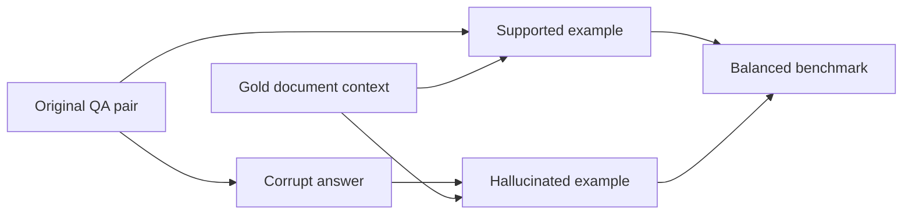

## Cấu Trúc Repository

```text
.
├── data/
│   ├── benchmarks/
│   │   └── hallucination_vi.jsonl
│   ├── kb/
│   ├── kb_vi/
│   └── processed_vi/
├── outputs/
│   ├── models/
│   ├── predictions/
│   └── vectorstore_vi/
├── reports/
│   ├── confusion_baseline.png
│   ├── confusion_phobert.png
│   ├── hallucination_report.md
│   ├── hallucination_types.png
│   └── metric_comparison.png
├── scripts/
│   ├── check_env.sh
│   ├── run_demo.sh
│   ├── run_train_hallucination.sh
│   └── setup_env.sh
├── src/
│   ├── demo/
│   │   └── app.py
│   ├── eval/
│   │   ├── create_hallucination_benchmark.py
│   │   ├── evaluate_metrics.py
│   │   ├── evaluate_retrieval.py
│   │   ├── generate_report.py
│   │   ├── hallucination_baselines.py
│   │   ├── hallucination_input.py
│   │   ├── metrics.py
│   │   └── predict_hallucination_transformer.py
│   ├── finetune/
│   │   ├── qlora_train.py
│   │   └── train_hallucination_detector.py
│   ├── rag/
│   │   ├── build_kb.py
│   │   ├── hybrid_retriever.py
│   │   └── query_rag.py
│   └── utils/
│       └── jsonl.py
├── AUDIT_REPORT.md
├── debug_dataset.py
├── inspect_model.py
├── requirements.txt
├── requirements-rag.txt
└── requirements-qlora.txt
```

## Cài Đặt

### Môi Trường Cơ Bản

```bash
bash scripts/setup_env.sh --reset
```

Lệnh trên cài môi trường cho hallucination benchmark, report, demo và PhoBERT detector.

Kiểm tra môi trường:

```bash
bash scripts/check_env.sh
```

Nên chạy bằng Python trong virtual environment:

```bash
./.venv/bin/python -m pip list
```

### Cài Thêm Dependencies Cho RAG

Nếu cần build vector store và chạy retriever:

```bash
INSTALL_RAG_DEPS=1 bash scripts/setup_env.sh --reset
```

### Cài Dependencies Cho QLoRA

QLoRA nên chạy trên Colab hoặc máy Linux có GPU:

```bash
./.venv/bin/python -m pip install -r requirements-qlora.txt
```

## Chuẩn Bị Dữ Liệu

QA dataset tiếng Việt đặt tại:

```text
data/processed_vi/bioasq_vi.jsonl
```

Định dạng mỗi dòng JSONL:

```json
{"id":"sample_id","question_vi":"...","answer_vi":"...","gold_docs":["doc_1.txt","doc_2.txt"]}
```

Knowledge base đặt tại:

```text
data/kb_vi/
```

Mỗi tài liệu là một file `.txt`.

## Build Knowledge Base

```bash
python src/rag/build_kb.py \
  --kb_dir data/kb_vi \
  --out_dir outputs/vectorstore_vi
```

## Chạy Hybrid Retrieval

```bash
python -m src.rag.hybrid_retriever \
  --kb_dir data/kb_vi \
  --vectorstore outputs/vectorstore_vi \
  --question "Bệnh Hirschsprung là rối loạn đơn gen hay đa yếu tố?" \
  --top_k 5
```

Hybrid retrieval kết hợp:

- BM25: mạnh với trùng khớp từ khóa;
- dense retrieval: mạnh với tương đồng ngữ nghĩa;
- score fusion: kết hợp điểm từ hai nguồn để chọn top-k context.

## Chạy RAG

```bash
python src/rag/query_rag.py \
  --model Qwen/Qwen2.5-1.5B-Instruct \
  --vectorstore outputs/vectorstore_vi \
  --top_k 5
```

## Fine-Tune LLM Bằng QLoRA

```bash
python src/finetune/qlora_train.py \
  --model Qwen/Qwen2.5-1.5B-Instruct \
  --train data/processed/train.jsonl
```

Module này phục vụ phần generator trong RAG. Đây là phần khác với PhoBERT verifier.

## Tạo Hallucination Benchmark

```bash
python -m src.eval.create_hallucination_benchmark \
  --qa data/processed_vi/bioasq_vi.jsonl \
  --kb_dir data/kb_vi \
  --output data/benchmarks/hallucination_vi.jsonl
```

Chạy baseline offline:

```bash
python -m src.eval.hallucination_baselines \
  --input data/benchmarks/hallucination_vi.jsonl \
  --output outputs/predictions/hallucination_baseline.jsonl
```

## Kiểm Tra Dataset Và Truncation

```bash
python debug_dataset.py \
  --input data/benchmarks/hallucination_vi.jsonl \
  --model vinai/phobert-base-v2 \
  --max_length 256
```

Script này in:

- sample text;
- label;
- token length trước và sau truncation;
- số token bị cắt;
- decoded tokens;
- thống kê answer có còn nằm trong sequence hay không.

## Fine-Tune PhoBERT Hallucination Detector

```bash
python -m src.finetune.train_hallucination_detector \
  --train data/benchmarks/hallucination_vi.jsonl \
  --model vinai/phobert-base-v2 \
  --output_dir outputs/models/hallucination_detector \
  --epochs 3 \
  --batch_size 8 \
  --learning_rate 2e-5
```

Nếu model đã có trong cache và muốn tránh gọi mạng:

```bash
python -m src.finetune.train_hallucination_detector \
  --train data/benchmarks/hallucination_vi.jsonl \
  --model vinai/phobert-base-v2 \
  --output_dir outputs/models/hallucination_detector \
  --local_files_only
```

Nếu môi trường global có TensorFlow hoặc package gây warning, có thể chạy qua script:

```bash
bash scripts/run_train_hallucination.sh \
  --train data/benchmarks/hallucination_vi.jsonl \
  --model vinai/phobert-base-v2 \
  --output_dir outputs/models/hallucination_detector
```

## Predict Bằng PhoBERT Detector

```bash
python -m src.eval.predict_hallucination_transformer \
  --input data/benchmarks/hallucination_vi.jsonl \
  --model outputs/models/hallucination_detector \
  --output outputs/predictions/phobert_hallucination_detector.jsonl
```

Output gồm:

- predicted label;
- confidence;
- probability của từng class;
- classification report;
- confusion matrix;
- file error analysis.

File lỗi được ghi tại:

```text
outputs/predictions/phobert_hallucination_detector.errors.csv
```

## Inspect Model

```bash
python inspect_model.py \
  --input data/benchmarks/hallucination_vi.jsonl \
  --model outputs/models/hallucination_detector \
  --num_samples 10
```

Script này load checkpoint và in nhanh:

```text
id    gold    pred    supported_prob    hallucinated_prob
```

## Sinh Report Và Biểu Đồ

```bash
python -m src.eval.generate_report
```

Report chính:

```text
reports/hallucination_report.md
```

Biểu đồ:

```text
reports/metric_comparison.png
reports/confusion_baseline.png
reports/confusion_phobert.png
reports/hallucination_types.png
```

## Chạy Demo

```bash
./.venv/bin/python -m streamlit run src/demo/app.py
```

Hoặc:

```bash
bash scripts/run_demo.sh
```

Chọn port khác:

```bash
bash scripts/run_demo.sh 8502
```

## Đánh Giá Generation Và Retrieval

Đánh giá chất lượng sinh câu trả lời:

```bash
python src/eval/evaluate_metrics.py \
  --pred outputs/predictions/pred.jsonl \
  --ref data/processed/test.jsonl
```

Đánh giá chất lượng truy xuất:

```bash
python src/eval/evaluate_retrieval.py \
  --pred outputs/predictions/pred.jsonl \
  --ref data/processed/test.jsonl
```

Các metric hỗ trợ:

- BLEU;
- ROUGE-L;
- BERTScore;
- Retrieval Recall@k;
- Accuracy;
- Macro F1;
- per-class precision/recall/F1;
- confusion matrix.

## Kết Quả Train PhoBERT

Log thực nghiệm sau khi train 3 epoch:

| Epoch | Eval Loss | Accuracy | Supported F1 | Hallucinated F1 | Macro F1 |
|---:|---:|---:|---:|---:|---:|
| 1 | 0.4677 | 0.7947 | 0.8248 | 0.7521 | 0.7885 |
| 2 | 0.4287 | 0.8008 | 0.8303 | 0.7589 | 0.7946 |
| 3 | 0.4687 | 0.8008 | 0.8285 | 0.7624 | 0.7955 |

Kết quả prediction trên toàn benchmark:

| Label | Precision | Recall | F1 |
|---|---:|---:|---:|
| supported | 0.7355 | 0.9614 | 0.8334 |
| hallucinated | 0.9443 | 0.6542 | 0.7730 |

Tổng quan:

```text
accuracy = 0.8078
macro_f1 = 0.8032
```

## Diễn Giải Kết Quả

Model đạt precision cao cho class `hallucinated`:

```text
hallucinated precision = 0.9443
```

Điều này nghĩa là khi model gắn nhãn một câu trả lời là hallucinated, dự đoán thường đáng tin cậy.

Recall của class `hallucinated` thấp hơn:

```text
hallucinated recall = 0.6542
```

Nghĩa là vẫn còn một phần câu trả lời hallucinated bị bỏ sót và bị dự đoán là `supported`. Đây là hướng cải thiện tiếp theo, đặc biệt quan trọng trong miền y tế vì false negative có rủi ro cao hơn false positive.

## Reproducibility Checklist

Để tái lập thí nghiệm:

1. Cài môi trường.
2. Chuẩn bị `data/processed_vi/bioasq_vi.jsonl` và `data/kb_vi/`.
3. Sinh hallucination benchmark.
4. Chạy `debug_dataset.py` để kiểm tra truncation.
5. Train PhoBERT detector.
6. Chạy prediction.
7. Sinh report.
8. Kiểm tra `error_analysis.csv`.

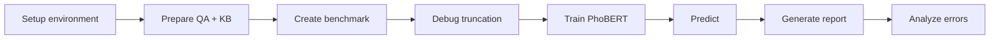

## Các File Quan Trọng

| File | Vai trò |
|---|---|
| `src/rag/build_kb.py` | Build vector store từ knowledge base |
| `src/rag/hybrid_retriever.py` | Hybrid retrieval BM25 + dense |
| `src/rag/query_rag.py` | Chạy pipeline RAG |
| `src/eval/hallucination_input.py` | Format input cho PhoBERT verifier |
| `src/eval/create_hallucination_benchmark.py` | Sinh benchmark hallucination |
| `src/finetune/train_hallucination_detector.py` | Fine-tune PhoBERT classifier |
| `src/eval/predict_hallucination_transformer.py` | Predict và đánh giá PhoBERT verifier |
| `debug_dataset.py` | Debug tokenization/truncation |
| `inspect_model.py` | Inspect nhanh checkpoint |
| `AUDIT_REPORT.md` | Báo cáo audit lỗi formatter và các fix |

## Hạn Chế

- Benchmark hallucination hiện được tạo tự động bằng rule-based corruption, chưa thay thế được đánh giá chuyên gia y tế.
- Recall của class `hallucinated` vẫn cần cải thiện để giảm false negative.
- Context dài vẫn bị truncate; formatter mới giữ được answer tốt hơn nhưng chưa phải long-context modeling đầy đủ.
- Kết quả phụ thuộc vào chất lượng knowledge base và retriever.
- Các câu hỏi y tế chuyên sâu cần kiểm chứng bởi nguồn dữ liệu và chuyên gia phù hợp trước khi dùng thực tế.

## Hướng Phát Triển

- Dùng context window hoặc evidence sentence selection để giảm truncation.
- Huấn luyện với hard negatives khó hơn.
- Thêm calibration cho confidence score.
- Thử focal loss hoặc threshold tuning để tăng hallucinated recall.
- Đánh giá trên tập test tách biệt theo chủ đề bệnh, thuốc, xét nghiệm và điều trị.
- Kết hợp verifier với RAG runtime để cảnh báo câu trả lời rủi ro cao.

## License

Xem file [LICENSE](LICENSE).
